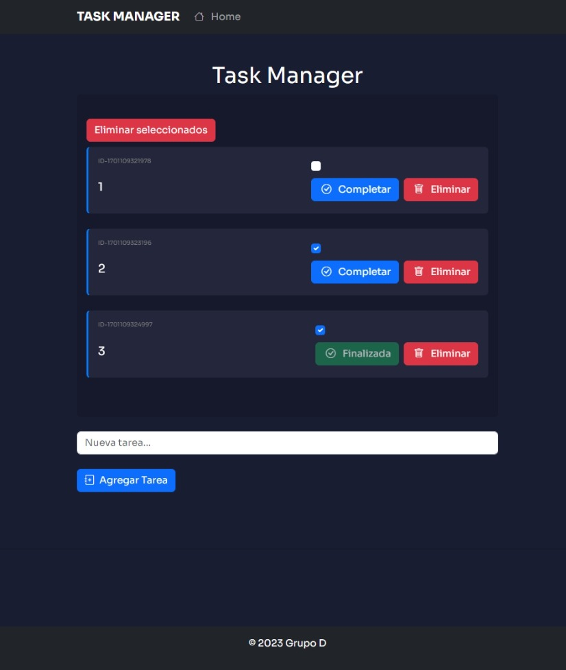

# **TRABAJO INTEGRADOR FINAL**
> Desarrollo en React JS

##  **Consigna**
Crear una aplicación web utilizando React que permita gestionar una lista de tareas. La
aplicación deberá hacer uso de componentes funcionales, el hook useState para el manejo del
estado, el hook useEffect para realizar efectos secundarios, y eventos para interactuar con el usuario.

------------
## **Requerimientos**
#### Componentes Funcionales:
- ###### Componente de Lista de Tareas (TaskList):
Este componente deberá mostrar la lista de tareas.
Recibirá como propiedades la lista de tareas y funciones para gestionar eventos
relacionados con las tareas (por ejemplo, marcar como completada, eliminar, etc.).
Cada tarea debe representarse mediante un componente TaskItem.
- ###### Componente de Tarea (TaskItem):
Este componente deberá representar individualmente una tarea.
Mostrará el nombre de la tarea y un botón para completarla.
Utilizará el estado local para gestionar la apariencia de la tarea (por ejemplo, tachado
cuando esté completada).
- ######  Componente de Formulario (TaskForm):
Este componente contendrá un formulario para agregar nuevas tareas.
Utilizará el estado local para gestionar la entrada del usuario y enviará la nueva tarea a
la lista principal.

------------
#### Estado con useState:
- ###### Estado Principal (tasks):
Utilizar el hook useState en el componente principal para gestionar el estado de la lista
de tareas.
Cada tarea debe ser un objeto con propiedades como id, nombre, y completada.

- ###### Efectos con useEffect:
Efecto de Actualización (useEffect en el componente principal):
Utilizar useEffect para realizar una acción (por ejemplo, mostrar un mensaje) cuando el
estado de la lista de tareas cambie.

------------
#### Interacción con el Usuario - Eventos:
- ###### Eventos en Componente de Lista (TaskList):
Implementar eventos que permitan al usuario interactuar con cada tarea (marcar
como completada, eliminar, etc.).
Estos eventos deberán modificar el estado principal (tasks).
- ###### Eventos en Componente de Formulario (TaskForm):
Implementar eventos para gestionar la entrada del usuario y agregar nuevas tareas a
la lista.

------------
#### Estilo y Diseño:
Aplicar estilos CSS para mejorar la apariencia de los componentes. Puede utilizar
bibliotecas como styled-components si lo desea.

------------
#### Puntos Extra (Opcionales):
Implementar la persistencia de datos utilizando localStorage para que las tareas
persistan incluso después de recargar la página.

------------

------------
&copy; 2023

